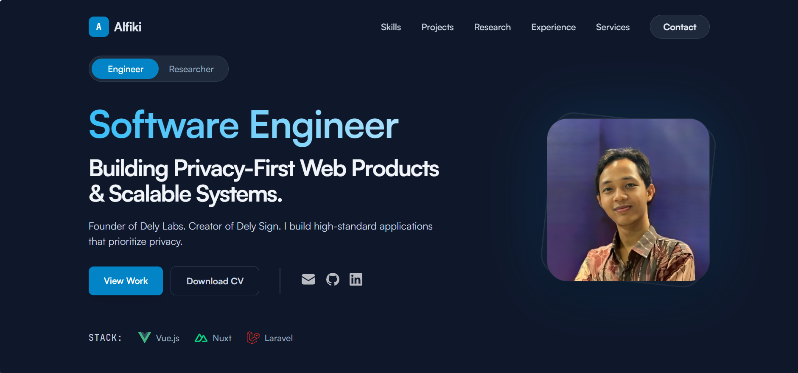

# Alfiki Diastama - Personal Portfolio 🚀

A modern, performance-focused portfolio website built with **Nuxt 3**, **Vue 3**, and **Tailwind CSS**. Designed to showcase my engineering journey from privacy-first web apps to AI research.



## 🌟 Key Features

This isn't just a static HTML site. It's a fully reactive web application featuring:

- **Modular Architecture:** Project data is managed via composables (`useProjects`) for easy maintenance and scalability.
- **Tiered Content System:** Automatically sorts projects into Featured (Tier 1), Experimental (Tier 2), and Archives (Tier 3/4).
- **Advanced Filtering:** Logic to filter projects by multi-tags (Web Dev, AI/Data, Mobile) with smooth transitions.
- **Performance:** Optimized assets, lazy loading components, and strict bundle analysis via Vite.
- **Dark Mode Native:** Designed with a developer-friendly high-contrast dark theme.

## 🛠️ Tech Stack

- **Framework:** [Nuxt 3](https://nuxt.com) (Vue 3 + Vite)
- **Styling:** [Tailwind CSS](https://tailwindcss.com)
- **Icons:** [Nuxt Icon](https://github.com/nuxt-modules/icon) (Iconify)
- **Animation:** Vue Transitions & CSS 3
- **Deployment:** Vercel / Netlify _(Sesuaikan nanti)_

## 📂 Project Structure

A glimpse into the engineering structure:

```bash
├── components/
│   ├── App/           # Global components (NavBar, Footer)
│   └── Home/          # Home-specific sections (Hero, Featured)
├── composables/
│   ├── useProjects.ts # Centralized source of truth for Project Data
│   └── useSkills.ts   # Skillsets & Tools configuration
├── pages/
│   ├── index.vue      # Homepage (Tier 1 & 2 showcase)
│   └── projects/      # The Archive Library (Filterable, All Tiers)
└── public/            # Static assets
```

## 🎨 Featured Works

Some of the highlight projects showcased in this portfolio:

1. **Dely Sign** - Client-side PDF signing tool (Privacy-first, GPU Rendered).
2. **Narajiwa** - Mental health superapp with real-time consultation.
3. **Dely Labs** - Experimental playground for developer productivity tools.

## 🚀 Setup & Development

Make sure to install the dependencies:

```bash
# npm
npm install

# pnpm
pnpm install
```

Start the development server on `http://localhost:3000`:

```bash
npm run dev
```

Build the application for production:

```bash
npm run build
```

## 📄 License

Designed & Developed by **Alfiki Diastama**.
Data and assets are personal copyright. Code structure is open for learning purposes.

---
